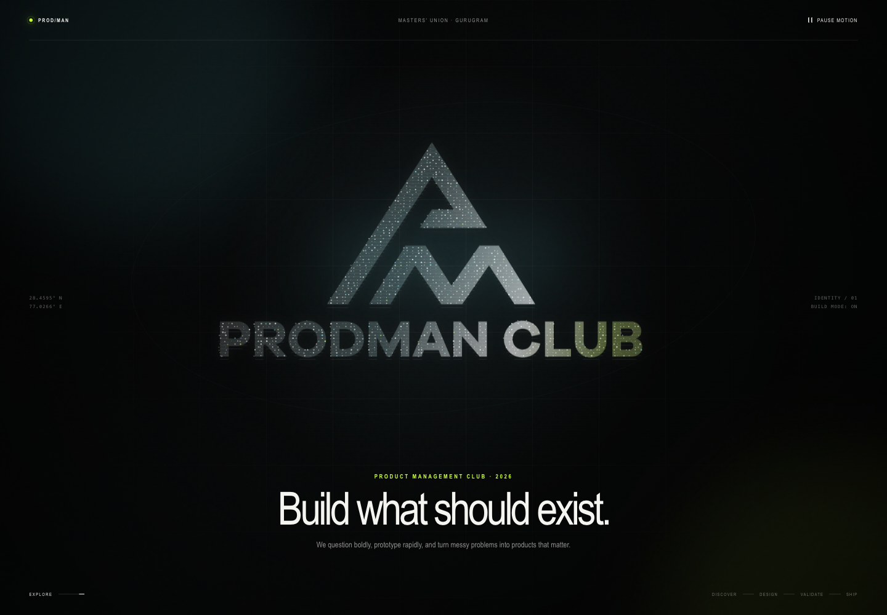
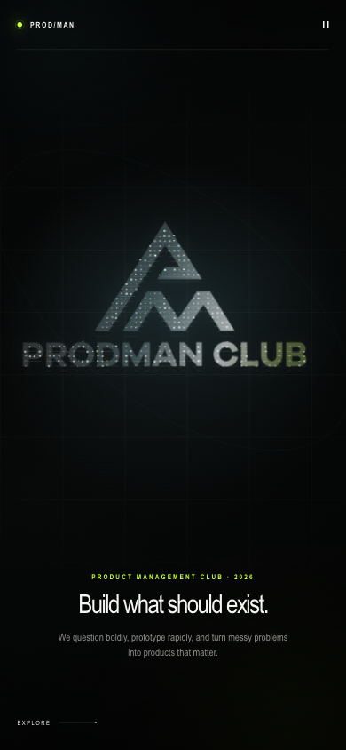

# Prodman Living Logo

Reusable, dependency-free hero animation for the Prodman Club website.

## Bundle contents

- `embed.html` — reusable section markup
- `prodman-living-logo.css` — component-scoped visual and motion styles
- `prodman-living-logo.js` — Canvas 2D particle system and motion lifecycle
- `Prodman-Logo.png` — transparent logo sampled by the particle system
- `Prodman-Logo.ico` — favicon asset
- `preview-desktop.png` and `preview-mobile.png` — verified reference renders

## Use it

1. Copy the markup from `embed.html` into the target page.
2. Load the stylesheet in the page `<head>`:

```html
<link rel="stylesheet" href="/resources/prodman-living-logo/prodman-living-logo.css" />
```

3. Load the script once, using `defer`:

```html
<script src="/resources/prodman-living-logo/prodman-living-logo.js" defer></script>
```

4. Ensure the section's `data-logo-src` and image `src` point to the bundled `Prodman-Logo.png` from the host page.

The component expects the IDs `brand-orbit`, `brand-particles`, and `motion-control`. Use one instance per page unless the JavaScript is extended to initialize multiple sections.

## Design controls

The main brand tokens are at the top of `prodman-living-logo.css`:

- `--ink` — background
- `--paper` — primary logo and text
- `--cyan` — spectral highlight
- `--acid` — signal accent
- `--stage-logo-width` — desktop logo scale

## Behavior contract

Preserve the pause control and reduced-motion path. The JavaScript caps pixel density, lowers particle count on mobile, and fully stops its animation loop when paused, off-screen, hidden, or reduced-motion is active.

## Verified previews




